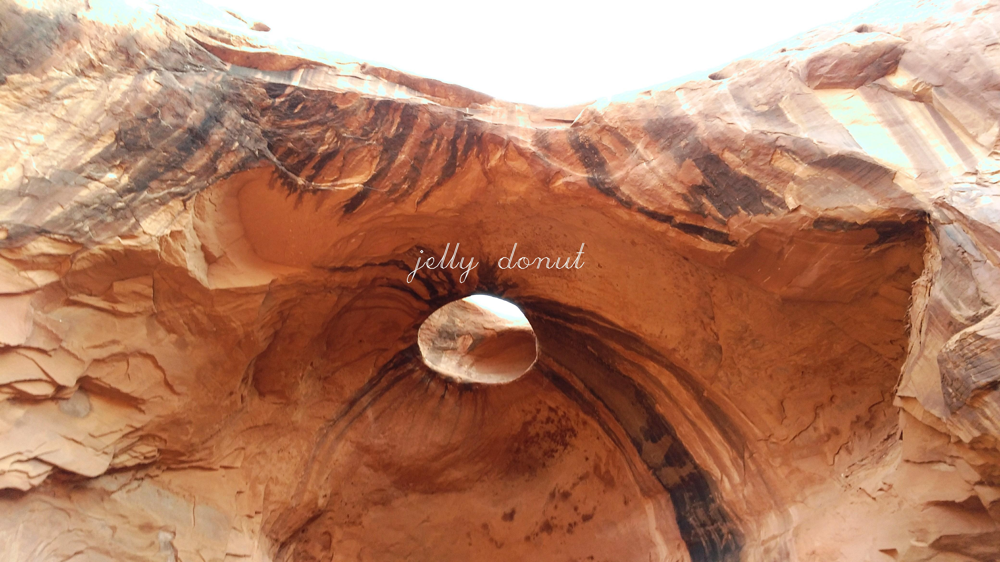

# Swear-Paper
Wallpaper Generation

A command line application to generate a new desktop wallpaper, using the newest post to /r/earthporn and google's naughty word list.

## Dependancies

See conanfile.txt

## Building

```bash
mkdir build
conan install --build=missing ..
cmake ..
make all
```

## Usage

```bash
./swear_paper <option>
Allowed Options:
  -h [ --help ]         Display help message
  -s [ --source ] arg   Specify the location of the swear word list
  -o [ --output ] arg   Output filename
  -q [ --quiet ]        Don't show info messages
  --skip arg            Skip to the nth image in the list of available ones
  --thickness arg       Thickness of the line used to print the word
```

## Results




